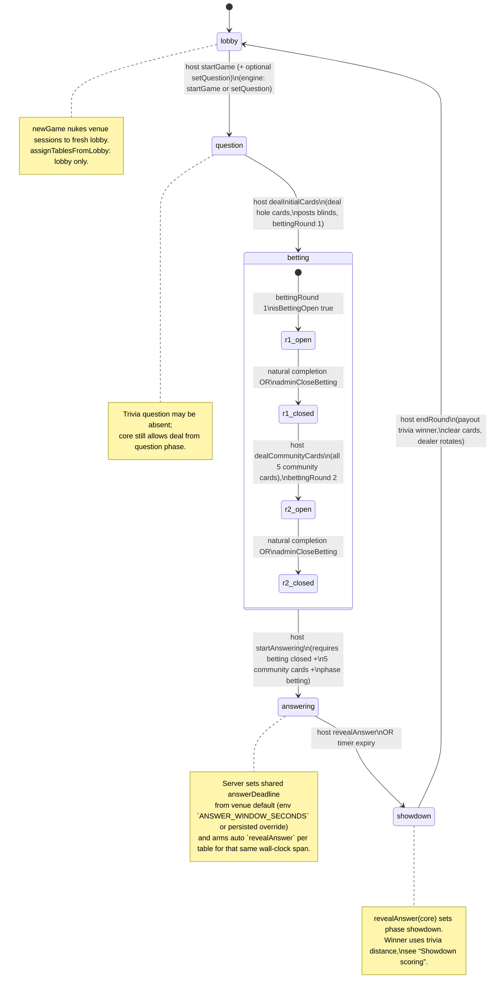

# Intended round machine (Quizz’em Hold’em)

This document is the **authoritative show-flow contract** between engine (`@qhe/core`), Socket.IO server (`apps/server`), host UI (`apps/host`), players, and displays. Poker **wagering** and **seven digit cards per player** mirror a table feel; **showdown resolves by numeric trivia proximity**, not poker hand ranking.

---

## Design principles

1. **Per-table phase** — Each `VENUE:tableId` session (e.g. `HOST01:1` … `HOST01:8`) has its own `GameState.phase` and `round`, but **the host drives many actions across all playable tables at once** when actions are routed venue-wide on the server.
2. **One shared trivia question per wave** — `setQuestion` (and venue-synced equivalents) aligns the active `round.question` across tables before deals; **`determineWinner` / `endRound`** use **`Question.answer`** vs each player’s **`submittedAnswer`**.
3. **Two betting waves** — `bettingRound: 1` = after hole cards, **before** board. `bettingRound: 2` = **after five community cards are dealt in one atomic step** (not flop → turn → river as separate streets in v1).
4. **Phases declared but not all exercised** — `GamePhase` includes `'reveal' | 'payout' | 'intermission'`. The **live loop today** spends most time in `lobby` → `question` → `betting` → `answering` → `showdown`, then **`endRound`** returns everyone to **`lobby`**. Unused phases are reserved for richer UX later unless wired.

---

## State machine (happy path)

---

## Phases (what each means)

| Phase | Intended meaning |
|--------|------------------|
| **lobby** | Between trivia rounds or after **`endRound`**. Fresh hands off; **`round.question` usually null** until **start / setQuestion** again. Rosters unchanged unless assign / join / disconnect. |
| **question** | Set up for the upcoming hand: **host may attach** `round.question` via bank / random / venue push / setlist. **Initial hole-card deal only allowed here** (`dealInitialCards`). |
| **betting** | Active wagering on **round 1 (pre-board)** or **round 2 (post-board)**. Turn order **`currentPlayerIndex`**; **`isBettingOpen`** gates player actions unless host uses **adminCloseBetting / adminAdvanceTurn**. |
| **answering** | Board is complete (**≥5 community cards** implied by server precondition), wagering closed on that table; players compose **`submittedAnswer`** by choosing **exactly five digit cards** from their holes + board (order + optional decimal), then submit before **`answerDeadline`**. |
| **showdown** | **Reveal** moment: core **`revealAnswer`** puts phase here; UI treats as “answers visible / trivia resolution prelude”. **`endRound`** performs payout + resets to **`lobby`**. |
| **reveal / payout / intermission** | **Not on the canonical path today** — avoid teaching host flows that depend on them until implemented end-to-end. |

---

## Showdown scoring (winner)

After **`phase === 'answering'`** (or logically after timer), **`revealAnswer`** moves to **`showdown`**.

- **`determineTriviaWinners`** (and legacy **`determineWinner`**, first seat only): Among non-folder players with **`submittedAnswer`** and a **`round.question`**, minimum `|answer − question.answer|`; **ties split the pot** evenly (whole dollars; remainder to earlier roster order among winner ids).
- **`endRound`**: Only runs from **`phase === 'showdown'`** (wrong phase → no-op in core). Pays **`round.pot`**: trivia winners if any eligible submission exists; else **sole survivor** (only one non-folder); else **split among all non-folders** (no valid trivia); else **split among all seated** if everyone folded (edge). Then increments **`roundId`**, clears cards/betting, rotates **`dealerIndex`**, **`phase: lobby`**. **Chip total (bankrolls + pot) is conserved** going into the next lobby.

Folding removes a player from **answer contention** (`hasFolded` skip in trivia resolution).

**`submitAnswer` (server)** rejects values that **cannot** be built from that player’s **two holes + five board** digits using **exactly five** digit cards in order with **at most one** decimal (matches player UI).

---

## Venue-wide vs single-session actions

**Host socket** resolves **`sessionKey`** from their joined lobby or table hello. Actions that **`assertVenueHost`** and loop **`allTableSessionsInVenue`** (or similar) broadcast the same semantic step to every **numbered playable table**:

- `startGame`, `setQuestion`, `nextQuestionFromSetlist`
- `dealInitialCards`, `dealCommunityCards`
- `adminCloseBetting`, `adminSetBlinds` (where wired venue-wide), `assignTablesFromLobby`
- `startAnswering`, `revealAnswer`, `endRound`
- **`newGame`**: resets **every** session key under the venue (**including lobby path** semantics per server impl — treat as catastrophic reset).

Actions that mutate **only** **`sessionKey`** (typical **`bet`, `fold`, `check`, `call`, `raise`, `allIn`, `submitAnswer`**) affect **that table only**.

Venue-wide host cues are **lockstep**: the server refuses a step unless **every existing numbered felt** shares the same **phase street** (betting wave, clock, board depth, trivia deadline where applicable). There are **no partial venue advances** — fix any straggler felt (or use **`newGame`** cautiously as a catastrophic reset).

---

## Server guardrails worth preserving

Venue-wide mutations (`startGame`, `setQuestion`, deals, `adminCloseBetting` when used as a host hammer, `startAnswering`, `revealAnswer`, `endRound`, …) run only when **every numbered table** passes the same precondition **and** shares the same **strict phase signature** — otherwise the host gets a **sync** toast and **no table** advances.

| Transition | Guards (summary) |
|------------|-------------------|
| **`startGame`**, **`setQuestion`**, setlist advance | All felts **aligned**; `startGame` requires **lobby** everywhere; question pushes require **lobby** or **question** everywhere. |
| **`dealCommunityCards`** | `phase === 'betting'`, **`bettingRound === 1`**, **`isBettingOpen === false`**, **`communityCards.length < 5`**. Deals **five** cards and opens **`bettingRound: 2`**. |
| **`startAnswering`** | **`phase === 'betting'`**, **`bettingRound === 2`**, **`!isBettingOpen`**, **`communityCards.length ≥ 5`**. Same **`answerDeadline`** on every felt; duration = **`answerWindowSeconds`** payload if provided, else venue default (host **Save default** + `hostLibrary`, or **`ANSWER_WINDOW_SECONDS`** / **`ANSWER_WINDOW_SEC`** on bootstrap), clamped **15–300**s. Venue-wide **`revealAnswer`** timer per table matches that duration. |
| **`submitAnswer`** | **`answering`** and before **`answerDeadline`**; value must be **constructible** from holes + board (exactly five digit positions, optional decimal). |
| **`endRound`** | All tables in **`showdown`** together; wrong mix → host toast, **no payouts**. |

---

## Host recovery levers

| Action | Effect |
|--------|--------|
| **adminCloseBetting** | Force-closes **open** wagering (**every table** must agree on the same street first). Use when players stall closing a wave so **`dealCommunityCards`** / **`startAnswering`** can unlock. Venue-wide lockstep enforced on the server. |
| **adminAdvanceTurn** | Advances **`currentPlayerIndex`** without validating player action — escape hatch only. |
| **revealAnswer** | Manual premature exit from **`answering`** to **`showdown`** (matches auto-timer semantics). Venue-wide fan-out where implemented. |
| **endRound** | Payout + full round cleanup → **`lobby`** venue-wide — only when **every** table is **`showdown`** together. |
| **newGame** | Fresh **`createEmptyGame`** per venue session — **destructive**. |

---

## Player actions (during `betting`)

Implemented in **`@qhe/core`**: **`check`, `call`, `raise`, `allIn`, `fold`**, plus low-level **`bet`**. Respect **`currentPlayerIndex`** and **`isBettingOpen`**. Raises enforce **minimum additive step related to big blind** in **`playerRaise`** (see core).

---

## Content (questions) and phase

- **`setQuestion`** resets **`phase` to `question`** and clears **`communityCards`** in that transition (see **`setQuestion`** in core).
- **Venue-synced** **`setQuestion`** on server applies chosen question to **all playable numbered tables**.
- Imports / CRUD mutate **persisted venue library**: **PostgreSQL** when `DATABASE_URL` is set (e.g. Railway plugin), otherwise **SQLite** under `apps/server/data/` — with one-time import from legacy JSON if the store is empty — orthogonal to phase until **`setQuestion` / random / next from setlist** fires.

---

## Display: join briefing vs 8-table wall

`/display` in **venue overview** shows **either**:

1. **`AudienceWelcomeWall`** (QR + URL + room code + “how to play”) — only while the server snapshot includes **`showAudienceWelcome: true`**. That flips to **`false`** after the host runs **`Assign from lobby`** (`markVenueShowStarted`), or after venue-wide **Start Game** if you never use lobby assign (single-table setups). It becomes **`true`** again only after host runs **New Game**, which clears that set entry and re-emits the venue snapshot.
2. **`VenueEightTablesPreview`** (numbered table mosaic + headline strip) — whenever briefing is off, **or** before the first snapshot arrives, **or** if this tab received a **local** layout relay (`BroadcastChannel`) from a host tab on the **same origin** (“mosaic forced”), **or** whenever any live tile’s phase has left **`lobby`** (display client safety). Numbered felts on the mosaic only appear **after** the host runs **`Assign from lobby`**: wall snapshot **`tiles`** is empty until then; the idle mosaic shows copy instead of eight placeholder felts once a snapshot has arrived without rows (pre-snapshot still uses the cinematic preview grid until the first **`displayVenueSnapshot`** arrives).

So: UI changes in **`AudienceWelcomeWall.tsx`** do not affect the mosaic; after **Assign from lobby** (or **Start Game** without assign) you will **not** see the join hero until **New Game** restores briefing.

**Production:** Express serves **`/display`** from **`apps/display/dist`**. Deploy must run **`npm run build`** at the **repo root** so the display bundle updates; building only **`apps/server`** leaves stale or missing TV assets. **`railway.toml`** runs **`scripts/railway-build.sh`**, which only runs **`npm run build`** (**`NPM_CONFIG_PRODUCTION=false`**). Railway **Railpack** runs dependency install in a **separate** step; running **`npm ci`** or **`rm -rf`** inside the **build** step conflicts with Railpack **BuildKit cache mounts** at **`/app/apps/<workspace>/node_modules/.vite`** and surfaces as **`EBUSY: rmdir`** (those paths are not deletable from the build script). Each app’s **`vite.config`** sets **`cacheDir`** under **`os.tmpdir()`** (**`quizzem-vite/<app>`**) so Vite’s own cache does not depend on **`node_modules/.vite`**. If you change this flow, read [Railpack caches](https://railpack.com/config/file#caches) first.

After deploy, **`index.html`** is sent with **`Cache-Control: no-store`** so browsers pick up new hashed JS/CSS; long-term cache applies only to **`/display/assets/*`**. On the TV tab, open DevTools → Elements on **`#root`** and check **`data-display-build`** (7-char git SHA, or **`local`** when built without CI env vars)—it must match the latest commit on GitHub for that deploy.

**Still looks unchanged?** Open the same display URL with **`&diag=1`** (e.g. `https://YOUR_HOST/display/?room=YOURCODE&diag=1`). A green diagnostic box shows **`data-display-build`**, the **`Cache-Control`** header from a fresh fetch to **`/display/index.html`**, and the real script URLs (hashed chunk names). Use that to prove whether the browser is running the latest bundle or serving a cached shell.

---

## Implementation map (where to enforce / document changes)

| Layer | Files |
|--------|--------|
| Types + transitions | `packages/core/src/index.ts` (`GameState`, **`startGame`, `setQuestion`, `dealInitialCards`, `dealCommunityCards`, `player*`**, **`submitAnswer`, `revealAnswer`, `endRound`**, **`createEmptyGame`**) |
| IO + timers + venue fan-out | `apps/server/src/index.ts` (**`action`** switch**, **`VENUE_SYNC_ACTION_TYPES`**, **`startAnswering`** deadline timer**, **`applyQuestionToAllPlayable`**)** |
| Host UX | `apps/host/src/App.tsx` (hints, guards, **`pushQuestionToVenue`**, deals, admins) |
| Player UX | `apps/player` emits **`action`** payloads constrained by **`GameState`** subscriptions |
| Display | Read-only **`state`** + optional **`DISPLAY` snapshots** |

---

## Changelog hygiene

When you change **preconditions** for any transition, update **this file** and any host-blocking hint text derived from stale assumptions (`dealInitialBlocked`, **`dealCommunityHint`**, **`startAnswering`** toasts, etc.) in the **same PR**.
